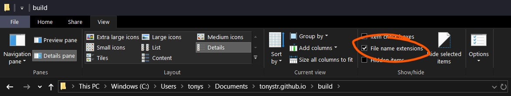

# JSON In Gamemaker

Say you're making an RPG. Your game is going to feature a plethora of different weapons, items and potions. *Some* weapons have effects (fire, ice, poison), and they deal different amounts of damage. The potions can cause all kinds of arcane effects to your character, and the items could be anything from apples to ancient scrolls to slugs. How do you keep track of all this complex data? There are many solutions, ranging from arrays to grids, all the way to strings. I'll convince you that JSON is the superior way to structure your data in Gamemaker. I'll also cover when JSON is *not* the superior way to structure your data, and what to do instead.

## JSON Object

JSON (JavaScript Object Notation) is really just a data format. It's mainly built for *serializing* (saving, encoding, turning data into text) JavaScript *objects*, which is a datatype that lets you define *key* - *value* pairs. In practice, this simply means an array where you use strings instead of numbers for the array indices. Because of JSON being based on JavaScript, I will show some examples from JavaScript, though fear not if it's a foreign language to you! I'll keep the JS examples simple and similar to GML. Here's an example of an array and an object in JavaScript.

```js
// Array defined exactly like in Gamemaker
var array = ["value1", 78, "cat"];

var object = { "key1": "value1", "number": 78, "meow": "cat" };

// `console.log()` prints a value, similar to `show_debug_message()` in GML.
// Hit that Play button in the top right to execute JavaScript code

// Outputs `value1`
console.log(array[0]);
console.log(object["key1"]);

// Outputs `78`
console.log(array[1]);
console.log(object["number"]);

// Outputs `cat`
console.log(array[2]);
console.log(object["meow"]);
```

In the example above, the object's *key* for the value "cat" is `"meow"`, while the array *index* for the value "cat" is `2`. Arrays and objects differ in that arrays store data *sequentially*, while objects assign values to keys, similarly to using variables. Javascript objects can also be defined in a different way which means exactly the same, but remember the object definition above.

```js
var object = new Object();

object["key1"]   = "value1";
object["number"] = 78;
object["meow"]   = "cat";

console.log(object["key1"]);
console.log(object["number"]);
console.log(object["meow"]);
```

JavaScript objects are also called by two other names; "dictionary" and "map". Gamemaker has a similar structure which it calls *ds_map*. If you're not familiar with data structures in Gamemaker, don't worry; they're nowhere near as scary as they might first seem.

## Using Maps In Gamemaker

Maps are created with the `ds_map_create()` function (this is pretty much equivalent to `new Object()` in JavaScript). Once created, you can access keys of the map with a notation similar to arrays and JavaScript objects, except you need to use the `?` *accessor*.

```gml
var map = ds_map_create();

map[? "key1"]   = "value1";
map[? "number"] = 78;
map[? "meow"]   = "cat";

show_debug_message(map[? "key1"  ]); // Outputs `value1`
show_debug_message(map[? "number"]); // Outputs `78`
show_debug_message(map[? "meow"  ]); // Outputs `cat`
```

If it wasn't for that `?` after every opening bracket (`[`), this would be near identical to JavaScript. When dealing with datastructures in Gamemaker, you can either use functions to get and set values, or you can use accessors. The accessor tells Gamemaker which type of data structure you're using. `?` means map, `#` means grid, `|` means list. Technically, there also exists an [accessor for arrays](https://docs2.yoyogames.com/source/_build/3_scripting/3_gml_overview/13_accessors.html), but that's for advanced use.

There really isn't much of a difference between using ``map[? "key"]`` and a variable ``mapKey``. You can set both to any kind of value (number, string, undefined), and you can read the value of both. Maps are useful because they can be much more *dynamic*. It's very easy to load in a map, giving you any number of key-value pairs, as opposed to reading some file line by line and manually storing each value in a variable. Additionally, you can use variables as keys, giving you more control over what data you're reading/writing. Lastly, maps (and other datastructures) can be "shared" very easily. Once you've created a datastructure, you can store that in multiple variables, arrays, even different objects, and they'll all refer to the same map.

```gml
map1 = ds_map_create();
map2 = map1; // both refer to the same map

map2[? "key1"]   = "value1";
map2[? "number"] = 78;
map1[? "meow"]   = "cat";
map1[? "health"] = 6;

show_debug_message(map2[? "key1"  ]); // Outputs `value1`
show_debug_message(map1[? "number"]); // Outputs `78`
show_debug_message(map1[? "meow"  ]); // Outputs `cat`
show_debug_message(map2[? "health"]); // Outputs `6`
show_debug_message(map1[? "health"]); // Outputs `6`
```

The reason that both of these variables refer to the same map, instead of copying the map when doing `map2 = map1`, is that datastructures in Gamemaker are technically just numbers. If you were to do `show_debug_message(ds_map_create())`, it would log some number. Maybe 0, maybe 1, maybe 2, maybe 64. It depends entirely on how many maps you've created in your game. Anyway, since datastructures are numbers, there isn't really any way for Gamemaker to tell what *type* of datastructure a variable has, or even if it is a data structure at all.

## Primitive types

Every language has something it calls *primitive types*. Think of these as the some of the building blocks of the language, what every value in you program, game or website is based on. In Javascript, those are `objects`, `numbers`, `strings` and `undefined`. In Gamemaker, they are `arrays`, `numbers`, `strings` and `undefined`. JavaScript does have arrays, but they're technically objects (they just have numbers as keys instead of strings). And Gamemaker has maps instead of JavaScript objects, but they're really just numbers (think of them as IDs for the actual data structures stored somewhere in memory). While Gamemaker does have arrays, it also has a very similar datastructure called *ds_list*. Lists are pretty much the same as arrays, except they use the `|` accessor, and need to be created with `ds_list_create()`. When dealing with JSON in Gamemaker, lists are preferred over arrays.

JSON's primitive types are `objects`, `arrays`, `numbers` and `strings`. Objects in JSON are written like the first example of JS objects in this tutorial. Arrays, numbers and strings are written like you're used to. Since JSON is just for storing data, it doesn't support any logic or anything more complex than primitive types. Every JSON file is an object with data inside.

```json
{
    "title": "This is a JSON file",
    "author": "TonyStr",
    "date_time_of_release": 1564744439000,
    "list": [2, 4, 5, 6, 8, "string", 5, 2, -8],
    "object": {
        "title": "this is an object inside an object!",
        "another_object": {
            "foods": ["apple", "banana", "MeatOnTheBone"]
        }
    }
}
```

Above is an example of a JSON file. You can nest as many lists and objects inside each other as you'd like.

## JSON in a file

Create a file (New Text Document) on your computer and call it `rpg_data.json`. You might have to enable "Show File Name Extensions" in your file explorer to be able to change the file type.



Right click it, and open with notepad, [Atom](https://atom.io/), [VSCode](https://code.visualstudio.com/) or whatever text-editing software you have available.

## Reading JSON From File

## JSON vs 2d Arrays

## Cleaning Datastructures

Datastructures are just numbers, and numbers are dirty
