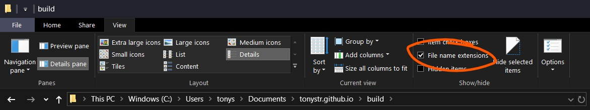
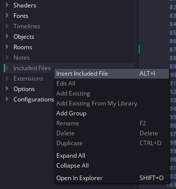

# JSON In Gamemaker

Say you're making an RPG. Your game is going to feature a plethora of different weapons, items and potions. *Some* weapons have effects (fire, ice, poison), and they deal different amounts of damage. The potions can cause all kinds of arcane effects to your character, and the items could be anything from apples to ancient scrolls to slugs. How do you keep track of all this complex data? There are many solutions, ranging from arrays to grids, all the way to strings. I'll convince you that JSON is the superior way to structure your data in Gamemaker. I'll also cover when JSON is *not* the superior way to structure your data, and what to do instead.

## JSON Object

JSON (JavaScript Object Notation) is really just a data format. It's mainly built for *serializing* (saving, encoding, turning data into text) JavaScript *objects*, which is a datatype that lets you define *key* - *value* pairs. In practice, this simply means an array where you use strings instead of numbers for the array indices. Because of JSON being based on JavaScript, I will show some examples from JavaScript, though fear not if it's a foreign language to you! I'll keep the JS examples simple and similar to GML. Here's an example of an array and an object in JavaScript.

```js
// Array defined exactly like in Gamemaker
var array = ["value1", 78, "cat"];

var object = { "key1": "value1", "number": 78, "meow": "cat" };

// `console.log()` prints a value, similar to `show_debug_message()` in GML.
// Hit that Play button in the top right to execute JavaScript code

// Outputs `value1`
console.log(array[0]);
console.log(object["key1"]);

// Outputs `78`
console.log(array[1]);
console.log(object["number"]);

// Outputs `cat`
console.log(array[2]);
console.log(object["meow"]);
```

In the example above, the object's *key* for the value "cat" is `"meow"`, while the array *index* for the value "cat" is `2`. Arrays and objects differ in that arrays store data *sequentially*, while objects assign values to keys, similarly to using variables. Javascript objects can also be defined in a different way which means exactly the same, but remember the object definition above.

```js
var object = new Object();

object["key1"]   = "value1";
object["number"] = 78;
object["meow"]   = "cat";

console.log(object["key1"]);
console.log(object["number"]);
console.log(object["meow"]);
```

JavaScript objects are also called by two other names; "dictionary" and "map". Gamemaker has a similar structure which it calls [ds_map](https://docs2.yoyogames.com/source/_build/3_scripting/4_gml_reference/data_structures/ds%20maps/). If you're not familiar with data structures in Gamemaker, don't worry; they're nowhere near as scary as they might first seem.

## Using Maps In Gamemaker

Maps are created with the `ds_map_create()` function (this is pretty much equivalent to `new Object()` in JavaScript). Once created, you can access keys of the map with a notation similar to arrays and JavaScript objects, except you need to use the `?` *accessor*.

```gml
var map = ds_map_create();

map[? "key1"]   = "value1";
map[? "number"] = 78;
map[? "meow"]   = "cat";

show_debug_message(map[? "key1"  ]); // Outputs `value1`
show_debug_message(map[? "number"]); // Outputs `78`
show_debug_message(map[? "meow"  ]); // Outputs `cat`
```

If it wasn't for that `?` after every opening bracket (`[`), this would be near identical to JavaScript. When dealing with datastructures in Gamemaker, you can either use functions to get and set values, or you can use accessors. The accessor tells Gamemaker which type of data structure you're using. `?` means map, `#` means grid, `|` means list. Technically, there also exists an [accessor for arrays](https://docs2.yoyogames.com/source/_build/3_scripting/3_gml_overview/13_accessors.html), but that's for advanced use.

There really isn't much of a difference between using ``map[? "key"]`` and a variable ``mapKey``. You can set both to any kind of value (number, string, undefined), and you can read the value of both. Maps are useful because they can be much more *dynamic*. It's very easy to load in a map, giving you any number of key-value pairs, as opposed to reading some file line by line and manually storing each value in a variable. Additionally, you can use variables as keys, giving you more control over what data you're reading/writing. Lastly, maps (and other datastructures) can be "shared" very easily. Once you've created a datastructure, you can store that in multiple variables, arrays, even different objects, and they'll all refer to the same map.

```gml
map1 = ds_map_create();
map2 = map1; // both refer to the same map

map2[? "key1"]   = "value1";
map2[? "number"] = 78;
map1[? "meow"]   = "cat";
map1[? "health"] = 6;

show_debug_message(map2[? "key1"  ]); // Outputs `value1`
show_debug_message(map1[? "number"]); // Outputs `78`
show_debug_message(map1[? "meow"  ]); // Outputs `cat`
show_debug_message(map2[? "health"]); // Outputs `6`
show_debug_message(map1[? "health"]); // Outputs `6`
```

The reason that both of these variables refer to the same map, instead of copying the map when doing `map2 = map1`, is that datastructures in Gamemaker are technically just numbers. If you were to do `show_debug_message(ds_map_create())`, it would log some number. Maybe 0, maybe 1, maybe 2, maybe 64. It depends entirely on how many maps you've created in your game. Anyway, since datastructures are numbers, there isn't really any way for Gamemaker to tell what *type* of datastructure a variable has, or even if it is a data structure at all.

## Primitive types

Every language has something it calls *primitive types*. Think of these as the some of the building blocks of the language, what every value in you program, game or website is based on. In Javascript, those are `objects`, `numbers`, `strings` and `undefined`. In Gamemaker, they are `arrays`, `numbers`, `strings` and `undefined`. JavaScript does have arrays, but they're technically objects (they just have numbers as keys instead of strings). And Gamemaker has maps instead of JavaScript objects, but they're really just numbers (think of them as IDs for the actual data structures stored somewhere in memory). While Gamemaker does have arrays, it also has a very similar datastructure called [ds_list](https://docs2.yoyogames.com/source/_build/3_scripting/4_gml_reference/data_structures/ds%20lists/). Lists are pretty much the same as arrays, except they use the `|` accessor, and need to be created with `ds_list_create()`. When dealing with JSON in Gamemaker, lists are preferred over arrays.

JSON's primitive types are `objects`, `arrays`, `numbers`, `strings` and `boolean`. The last type, `boolean` is just either `true` or `false`. In Gamemaker, this will become 1 and 0, since Gamemaker booleans are just `number`s. Objects in JSON are written like the first example of JS objects in this tutorial. Arrays, numbers and strings are written like you're used to. Since JSON is just for storing data, it doesn't support any logic or anything more complex than primitive types. Every JSON file is an object with data inside.

```json
{
    "title": "This is a JSON file",
    "author": "TonyStr",
    "date_time_of_release": 1564744439000,
    "list": [2, 4, 5, 6, 8, "string", 5, 2, -8],
    "object": {
        "title": "this is an object inside an object!",
        "another_object": {
            "foods": ["apple", "banana", "MeatOnTheBone"],
            "is_inside_object": true,
            "is_a_list": false
        }
    }
}
```

Above is an example of a JSON file. You can nest as many lists and objects inside each other as you'd like.

## JSON in a file

Create a file (New Text Document) on your computer and call it `rpg_data.json`. You might have to enable "Show File Name Extensions" in your file explorer to be able to change the file type.



Right-click it, and open with [Atom](https://atom.io/), [VSCode](https://code.visualstudio.com/), notepad or whatever text-editing software you have available. Note: although you technically can write JSON in any text editor you like, a [code editor](https://en.wikipedia.org/wiki/Source-code_editor) that provides [syntax highlighting](https://en.wikipedia.org/wiki/Syntax_highlighting) will be a tremendous help when writing JSON. If you miss a quote, comma or colon, your JSON will be invalid, leading to issues when you want to use this data. Below is an example of invalid JSON with syntax highlighting:


Once you've created the JSON file, (even if it's still empty), fire up Gamemaker and add the file to "Included Files"



You can pretty much handle whitespace (spaces, newlines, tabs) however you want, but missing commas, quotes, braces and brackets will break your JSON. If you're not sure what's wrong with your JSON, you can use an [online JSON validator](https://jsonformatter.curiousconcept.com/).
I will use the following JSON in the `rpg_data.json` file for the next section's examples.

```json
{
    "weapons": [{
        "name": "longsword",
        "sprite": "spr_longsword",
        "damage": 3,
        "weight": 13
    },{
        "name": "rapier",
        "sprite": "spr_rapier",
        "damage": 1,
        "weight": 4.3
    },{
        "name": "axe",
        "sprite": "spr_axe",
        "damage": 3,
        "weight": 9.7
    },{
        "name": "steel_bow",
        "sprite": "spr_bow",
        "damage": 2,
        "weight": 13,
        "arrow_count": 8,
        "elasticity": 12
    },{
        "name": "burning_longsword",
        "sprite": "spr_burning_longsword",
        "damage": 2.4,
        "weight": 12,
        "effects": ["fire"]
    },{
        "name": "enchanted_bow",
        "sprite": "spr_enchanted_bow",
        "damage": 2.4,
        "weight": 12,
        "arrow_count": 8,
        "elasticity": 12,
        "effects": ["ice", "poison", "lightning"]
    }],

    "items": [{
        "name": "apple",
        "effects": ["heal"]
    },{
        "name": "scroll",
        "type": "ancient",
        "effects": ["lightning"],
        "mana_cost": 17
    },{
        "name": "slug",
        "has_shell": true
    }],

    "potions": [{
        "name": "Vial of Thunder",
        "effects": ["lightning", "sight"]
    },{
        "name": "Potion of Farsight",
        "effects": ["sight"]
    },{
        "name": "Philter of Pheromones"
    },{
        "name": "Potion of Speed",
        "effects": ["speed"]
    },{
        "name": "Draught of Bribery",
        "effects": ["luck"]
    },{
        "name": "Flask of Desires",
        "effects": ["luck", "accuracy", "strength"]
    },{
        "name": "Elixir of Empowerment",
        "effects": ["strength"]
    },{
        "name": "Draught of Accuracy",
        "effects": ["accuracy"]
    },{
        "name": "Draught of the Unknown",
        "effects": ["random"]
    },{
        "name": "Potion of Defense",
        "effects": ["defense"]
    }]
}
```

This JSON consists of three lists ("weapons", "items", "potions"). Every weapon, item and potion has a "name", many of them have "effects", and some have more properties. All of the weapons have damage and weight. This is kinda messy, and it can be hard to keep track of which objects can have which properties, so it might be helpful to write another JSON document that describes the structure of your JSON ([JSON schema](https://json-schema.org/)). This isn't necessary, and if it causes more confusion than understanding, ignore the rest of this section. In the case of the example above, the JSON schema I've made is:

```json
{
    "type": "object",
    "required": true,
    "properties": [{
        "key": "weapons",
        "type": "list",
        "required": true,
        "children": [{
            "type": "object",
            "required": false,
            "properties": [{
                "key": "name",
                "type": "string",
                "required": true
            },{
                "key": "sprite",
                "type": "string",
                "required": true
            },{
                "key": "damage",
                "type": "number",
                "required": true
            },{
                "key": "weight",
                "type": "number",
                "required": true
            },{
                "key": "effects",
                "type": "list",
                "required": false,
                "children": [{
                    "type": "string",
                    "required": false
                }]
            },{
                "key": "arrow_count",
                "type": "number",
                "required": false
            },{
                "key": "elasticity",
                "type": "number",
                "required": false
            }]
        }]
    },{
        "key": "items",
        "type": "list",
        "required": true,
        "children": [{
            "type": "object",
            "required": false,
            "properties": [{
                "key": "name",
                "type": "string",
                "required": true
            },{
                "key": "effects",
                "type": "list",
                "required": false,
                "children": [{
                    "type": "string",
                    "required": false
                }]
            },{
                "key": "type",
                "type": "string",
                "required": false
            },{
                "key": "mana_cost",
                "type": "number",
                "required": false
            },{
                "key": "has_shell",
                "type": "boolean",
                "required": false
            }]
        }]
    },{
        "key": "potions",
        "type": "object",
        "required": true,
        "children": [{
            "type": "object",
            "required": false,
            "properties": [{
                "key": "name",
                "type": "string",
                "required": true
            },{
                "key": "effects",
                "type": "list",
                "required": false,
                "children": [{
                    "type": "string",
                    "required": false
                }]
            }]
        }]
    }]
}
```

This has no practical use beyond mapping out what kind of data your JSON keeps track of, but if you're working with others, this can be very helpful for your collaborators to understand how to deal with the JSON data.

## Loading JSON From File

Once you've got your JSON file, you'll want to load it in to Gamemaker. One way to do this is to use the `file_text_open_read()` functions, to read it as a text file. However, we want the whole file simply loaded in as one big string, so it's actually easier to just use `buffer_read()` functions. Below is a script called `json_load()`, which takes a filename (or file path) as argument, and returns a ds_map:

```gml
/// @func json_load(fname)
/// @desc Loads external JSON file into datastructure
/// @arg fname

var _buff = buffer_load(argument0);
var _out = buffer_read(_buff, buffer_string);
buffer_delete(_buff);
return json_decode(_out);
```

Four lines of code is all it takes! The function `json_decode()` reads a string, and [parses](https://en.wikipedia.org/wiki/Parsing) it as JSON, then spits out a ds_map, containing all the data in your JSON file.

## Using JSON data

You might want to load your JSON data into a global variable, or somewhere that makes it easily accessible from anywhere in your game. Let's make global variables for each of the lists in the JSON, in a new script called `INIT()`.

```gml
/// @func INIT()

gml_pragma("global", "INIT()");

global.rpg_data = json_load("rpg_data.json");

global.weapons  = global.rpg_data[? "weapons"];
global.items    = global.rpg_data[? "items"];
global.potions  = global.rpg_data[? "potions"];
```

The line, `gml_pragma("global", "INIT()");`, makes the script automatically run at the start of the game, without you ever having to call `INIT()` anywhere in your code. You could just define globals in a game start event, or even just the create event of some object, but this way we don't need to worry about instance creation order. You can read more about `gml_pragma()` [here](https://docs2.yoyogames.com/source/_build/3_scripting/4_gml_reference/miscellaneous/gml_pragma.html).

Now, let's give a player object it's own sword. We could just do `sword = global.weapons[| 0]`, however it's more readable if we select a sword by it's name, rather than it's index in the weapons array. Let's write a quick script to find a map inside a list, which has a key that matches a given value:

```gml
/// @func ds_list_find_map(list, key, value)
/// @desc Finds a map inside a list which has a `key` that matches `value`
/// @arg list
/// @arg key
/// @arg value

var _list = argument0;
var _key  = argument1;
var _val  = argument2;
var _ls	  = ds_list_size(_list);

for (var i = 0; i < _ls; i++) {
	var _map = _list[| i];

	if (ds_exists(_map, ds_type_map) && _map[? _key] == _val) {
		return _map;
	}
}

return undefined;
```

Now we can get a sword in a much more reliable way.

```gml
sword = ds_list_find_map(global.weapons, "name", "longsword");
```

Then, when the player deals damage to an enemy, let's use the weapon's damage value.

```gml
_instance.hp -= sword[? "damage"];
```


Now, if you want to use the "sprite" in the JSON, you have to find the *asset index* of it. You can't just do `draw_sprite(sword[? "sprite"], 0, x, y)`, since that will try to draw the *string* "spr_longsword". It's the same as writing `draw_sprite("spr_longsword", 0, x, y)`, but you need `draw_sprite(spr_longsword, 0, x, y)`. To achieve this, use the function `asset_get_index()`.

```gml
draw_sprite(asset_get_index(sword[? "name"]), 0, x, y);
```

Now, with a quick snippet of code for switching weapons, let's see it in-game.

```gml
var _change = keyboard_check_pressed(vk_right) - keyboard_check_pressed(vk_left);
if (_change != 0) {
	var _weapons = ["longsword", "rapier", "axe"];
	var _len = array_length_1d(_weapons);
	var _index = (array_find_index(_weapons, sword[? "name"]) + _change + _len) % _len;
	sword = ds_list_find_map(global.weapons, "name", _weapons[_index]);
}
```


Note: if you have an object inside an object inside an object, and you want to get the innermost object in gml, sadly you can't currently do `json[? "object1"][? "object2"][? "object3"]`, instead, create a local variable for `var _object1 = json[? "object1"];`, then do `var _object2 = _object1[? "object2"];` and repeat. This feature is promised to come along with a bunch of gml features in the near future, though! (This also applies to ds_lists)

## Saving JSON

## JSON vs 2d Arrays

## Cleaning Datastructures

Datastructures are just numbers, and numbers are dirty
