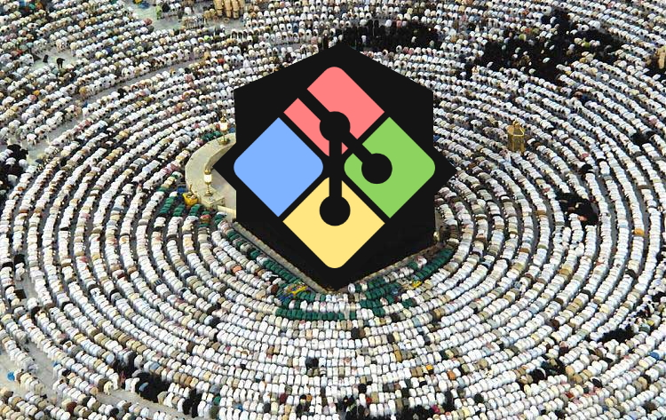
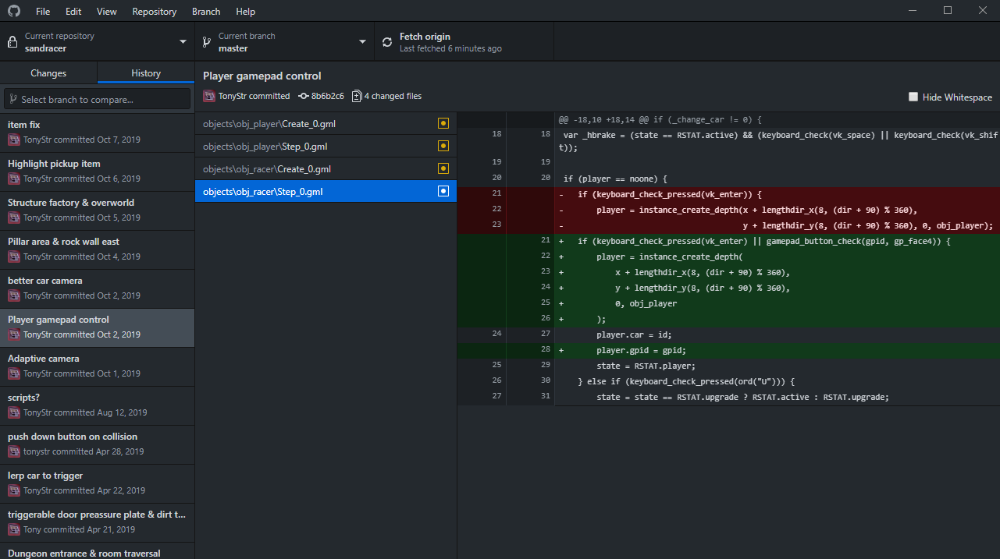

# Source Control in GMS2

You may have heard people chanting religiously about source control, version control, git, etc. Thinking about source control as a religion wouldn't be entirely absurd except for the fact that there would be only one religion, and everyone agreed the religion was 100% correct. Source Control is the modern equivalent of magic. You can perform necromancy, view parallel timelines, travel through time and so much more. The ironic part is that all of this isn't even particularly hard to get into and master. Read this tutorial, and I promise you'll be a modern sorcerer by the last paragraph.

## What is Source Control

Source control is a term for software that manages changes to data, here typically *source code*, but it also manages images, sound, and any other data that might be associated with your games. Source code is often also called version control (manager), scm, vcm or revision control. The trickiest thing about source control is the [slightly backwards terminology](https://en.wikipedia.org/wiki/Version_control#Common_terminology), but I'll take you through all the terminology we need. There are different source control managers, but the most common one is git -- at least in Gamemaker development and webdev. Git is developed by programmers for programmers, so it's not super intuitive. Instead, it tries to be as modular as possible. As a consequence, there are plenty of services that integrate with git. Some code editors like [Atom](https://atom.io/) come with integrated git support, and technically so does Gamemaker! However, the source control implementation in Gamemaker is a bit lacking, causes slowdowns and is a bit unintuitive. Thankfully there exists solutions that are easier to work with.

[Github](https://github.com/) is the largest source control host in the world, and it offers it's own beautifully simplistic [git GUI](https://desktop.github.com/). If you have some familiarity with networking, Github is the server, and git is the client. Git runs on your computer, tracks all the changes to your code and your files, and works perfectly fine by itself. However, with today's technology, there's no reason to run the risk of having precious data stored on your computer, when you can also back it up in a cloud. Github is one of those clouds, though it also offers a bunch of tools that expands on what you can do with git. Github *desktop* is the program that Github has developed for running on your computer. This gives you a visual application to interact with, rather than writing commands into a commandline for dealing with git. Many prefer doing exactly that, but a git GUI such as Github desktop is more efficient to use, lends some helpful tools, and is overall way more intuitive.

They way you typically interact with git, is you write some code, draw some sprites or create some assets, then go to git and make a "commit". This is as simple as writing a sentence about what you just did, and pressing a button. You can then go back to your code/art/assets and keep working. How frequently to commit is a dilemma people have to face. Some like to commit once a day, some like to commit every few lines they write. I like committing for each bug I fix, or each feature I add. The thing with commits is that each commit is a snapshot of time in your repository (project). If you want to look at the history of your repository, you will get a list of all your commits, and you can navigate through them to see what files changed, and what lines were added/deleted/changed in it. Git lets you very easily compare those changes to other points in time.

## Setting up

Go [make yourself a user](https://github.com/join?source=tonystr.net) at github, and download the git GUI "[Github Desktop](https://desktop.github.com/)"

## Time Travel

## Collaboration
